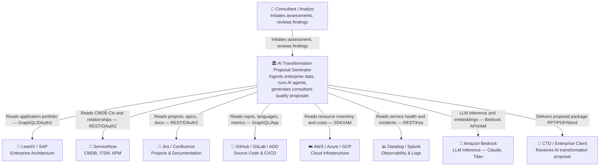
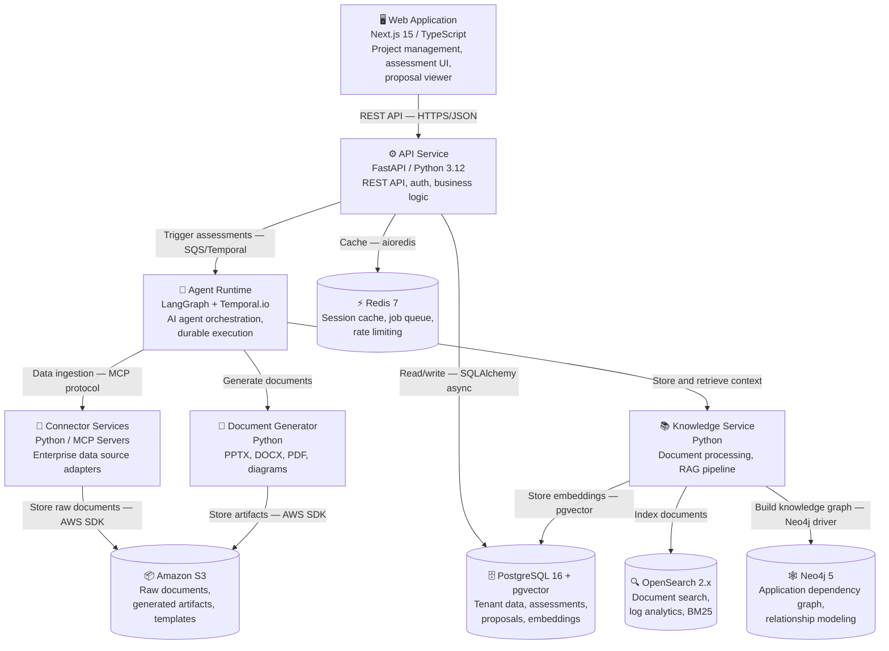

# AI Transformation Proposal Generator — Comprehensive Technical Research

**Date:** 2026-06-26
**Author:** Balu
**Research Type:** Technical — Enterprise SaaS Platform
**Classification:** Principal Architect Level — AWS Professional Services / Big Four Grade

---

## Research Overview

This document presents exhaustive technical research for building an **AI Transformation Proposal Generator** — an AI-native enterprise SaaS platform that automates the creation of consultant-quality AI transformation proposals.

Research was conducted across 12 domains: competitive landscape, enterprise data source APIs, AI orchestration architecture, knowledge management, document generation, AI analysis techniques, security & compliance, technology stack, scalability, AI workflow design, enterprise integrations, and market analysis.

**Key finding:** No current product fully automates end-to-end enterprise AI transformation proposal generation with multi-source data ingestion. This is a genuine and significant market gap. The recommended architecture is a **LangGraph-orchestrated multi-agent system**, deployed on **AWS with a cloud-agnostic abstraction layer**, using **PostgreSQL + pgvector + OpenSearch hybrid RAG**, with **FastAPI backend** and **Next.js frontend**.

---

## Table of Contents

1. Executive Summary
2. Competitive Landscape Analysis
3. Enterprise Data Sources & API Reference
4. AI Architecture Recommendation
5. Knowledge Management & RAG Strategy
6. Document Generation Architecture
7. AI Analysis Techniques
8. Security & Compliance Design
9. Technology Stack Recommendation
10. Scalability Architecture
11. AI Workflow & Agent Design
12. Enterprise Integration Patterns
13. Market Analysis & Pricing Strategy
14. System Context Diagram (C4 Level 1)
15. C4 Container Diagram (Level 2)
16. Functional Architecture
17. Technical Architecture
18. AWS Reference Architecture
19. Data Model
20. API Design
21. Build vs. Buy Analysis
22. Risk Analysis
23. Cost Estimate
24. MVP Scope
25. Development Roadmap
26. Folder & Repository Structure
27. Microservice Architecture
28. Testing Strategy
29. Deployment Strategy
30. Monitoring Strategy
31. Cost Optimization Strategy
32. Open Questions
33. Future Enhancements

---

## 1. Executive Summary

### The Problem

Large enterprises spend **4–12 weeks** manually producing AI transformation proposals. The process requires senior consultants manually gathering data from 10+ systems (LeanIX, Jira, GitHub, Confluence, cloud platforms), synthesizing it, then producing a PPT deck, executive summary, AI roadmap, ROI model, and architecture recommendations. This is **expensive** ($150K–$500K per engagement), **inconsistent**, and heavily dependent on individual consultant knowledge.

### The Opportunity

The global AI consulting services market is valued at **$11.07 billion (2025)**, growing at **23–34% CAGR**, projected to reach **$90B+ by 2035**. No current product fully automates enterprise AI transformation proposal generation with multi-source data ingestion. Competitors are **tools, not automated proposal generators** — they require human consultants to use them.

### The Solution

An **AI-native SaaS platform** that:
1. Connects to enterprise data sources via secure connectors
2. Ingests application portfolios, codebases, architecture docs, and operational data
3. Runs specialized AI agents to analyze and synthesize insights
4. Produces consultant-quality proposal packages (PPT, PDF, Word, diagrams) in hours, not weeks

### Key Technical Findings

- **LangGraph** is the recommended AI orchestration framework for production-grade multi-agent systems with full state management, human-in-the-loop, and audit trails
- **MCP** (Model Context Protocol) + **A2A** (Agent2Agent) are complementary open standards: MCP handles agent-to-tool connections, A2A handles agent-to-agent collaboration — both should be adopted
- **Hybrid RAG** (dense vector + BM25 keyword + reranking) with **GraphRAG** for relationship-aware retrieval is the current enterprise standard
- **PostgreSQL + pgvector** is recommended as the primary vector store for MVP (scales to 100M+ vectors); **Qdrant** as the scale-out option
- **Amazon Bedrock** with Claude Sonnet as primary model, with multi-model routing capability
- **AWS ECS Fargate + SQS + Step Functions** for the AI agent execution layer
- **Hybrid pricing** (platform fee + usage-based) is the enterprise SaaS standard for AI products

### Top 5 Strategic Recommendations

1. **Adopt LangGraph** as the agent orchestration layer — it provides deterministic, auditable, production-grade multi-agent state machines critical for enterprise trust
2. **Build an MCP server layer** for each enterprise data source — this makes the platform future-proof and compatible with any LLM that adopts MCP
3. **Use a Hybrid RAG architecture** with document-type-aware chunking from day one — retrofitting retrieval is expensive
4. **Design for multi-tenancy from day one** using PostgreSQL RLS + tenant-scoped namespaces in all vector stores
5. **Lead with document quality** — the proposal output (PPT, PDF) is the product's primary value artifact; invest heavily in templating and brand-quality output

---

## 2. Competitive Landscape Analysis

### 2.1 Enterprise Architecture Tools

#### LeanIX (now SAP)
| Attribute | Detail |
|-----------|--------|
| **Category** | Enterprise Architecture Management (EAM) |
| **Core Capability** | Application portfolio management, IT landscape visualization, fact sheets |
| **APIs** | REST API, GraphQL API (Fact Sheets), Integration API (LDIF format), Webhooks |
| **AI Capabilities** | AI agents via Copilot and Claude integration; AI-assisted documentation |
| **Pricing** | Quote-based; typically **$50K–$200K+/year** based on # apps; unlimited users |
| **Strengths** | Excellent data model, strong SAP ecosystem integration, unlimited users |
| **Weaknesses** | Does not auto-generate proposals; requires manual analysis; SAP acquisition may slow innovation |
| **Our Opportunity** | LeanIX is a **data source** for us — read their fact sheets via GraphQL API |

#### ServiceNow APM
| Attribute | Detail |
|-----------|--------|
| **Category** | ITSM + CMDB + APM |
| **Core Capability** | CMDB, CI relationships, service topology, CSDM framework |
| **APIs** | Table API, CMDB Instance API, Query Builder, Service Graph Connectors |
| **Pricing** | $100K–$500K+/year enterprise; complex module-based pricing |
| **Strengths** | Most complete CMDB in the market, deep enterprise penetration, CSDM standard |
| **Our Opportunity** | Rich CMDB data source; read CI topology, business applications, relationships |

#### Ardoq
| Attribute | Detail |
|-----------|--------|
| **Category** | Cloud-native EA platform |
| **APIs** | REST API (full), Import Builder, bidirectional sync |
| **Pricing** | $30K–$150K/year |
| **Strengths** | Modern UX, strong REST API, collaborative, cloud-native |
| **Our Opportunity** | Read business capability maps and application portfolios |

#### MEGA HOPEX
| Attribute | Detail |
|-----------|--------|
| **Strengths** | Deep compliance frameworks (TOGAF/DoDAF), regulated industries |
| **Weaknesses** | On-premise-first, high implementation cost, slow innovation |

#### CAST Highlight
| Attribute | Detail |
|-----------|--------|
| **Core Capability** | Cloud readiness scoring, technical debt measurement, application health |
| **Strengths** | Deep code-level analysis, cloud readiness scoring |
| **Weaknesses** | Point solution; no proposal generation; no business context |
| **Our Opportunity** | Competitor AND potential data source — integrate CAST scores |

#### Backstage (Spotify/CNCF)
| Attribute | Detail |
|-----------|--------|
| **Category** | Internal Developer Portal (IDP) — open source |
| **Our Opportunity** | Read software catalog data — application metadata, ownership, tech stack |

#### OpsLevel
| Attribute | Detail |
|-----------|--------|
| **Category** | SaaS IDP with service maturity scorecards |
| **Our Opportunity** | Maturity scorecard data feeds into AI readiness assessment |

#### Harness
| Attribute | Detail |
|-----------|--------|
| **Core Capability** | CI/CD, feature flags, cloud cost, chaos engineering |
| **Our Opportunity** | Deployment frequency, DORA metrics for modernization assessment |

### 2.2 Competitive Positioning Matrix

| Capability | LeanIX | ServiceNow | Ardoq | CAST | **Our Platform** |
|------------|--------|------------|-------|------|-----------------|
| Auto-ingest enterprise data | ❌ | ❌ | ❌ | Partial | ✅ |
| Multi-source aggregation | ❌ | ❌ | ❌ | ❌ | ✅ |
| AI agent analysis | ❌ | Partial | Partial | ❌ | ✅ |
| Auto-generate PPT/PDF | ❌ | ❌ | ❌ | ❌ | ✅ |
| ROI calculation | ❌ | ❌ | ❌ | ❌ | ✅ |
| Cloud-native SaaS | ✅ | Partial | ✅ | ✅ | ✅ |
| Proposal generation time | Weeks | Weeks | Weeks | Days | **Hours** |

### 2.3 Market Gap

```
Current Tools → Require consultants to USE them → Manual proposal generation → 4-12 weeks
Our Platform  → Autonomous ingestion → AI agent analysis → Automated proposal → Hours
```

**The gap is clear**: Every competitor requires humans to operate the tool and generate insights. **No product automatically generates enterprise-grade AI transformation proposals.** This is a genuine greenfield opportunity.

---

## 3. Enterprise Data Sources & API Reference

### 3.1 Enterprise Architecture Systems

#### LeanIX
```
Authentication:  OAuth2 client_credentials flow
Base URL:        https://{host}.leanix.net/services/
REST API:        /pathfinder/v1/*  (workspace, meta-model, users)
GraphQL API:     /pathfinder/graphql  (Fact Sheets — applications, capabilities)
Integration API: LDIF format for bulk data exchange
Webhooks:        Supported via subscription endpoints
Key Data:        Application portfolio, business capabilities, tech stacks, lifecycle states
```

#### ServiceNow CMDB
```
Authentication:  OAuth2 (recommended); Service Account + minimum cmdb_read role
Table API:       /api/now/table/{tableName}
CMDB Instance:   /api/now/cmdb/instance/{className}
Key Rule:        Always use IRE for data ingestion (not direct table writes)
Rate Limits:     Consumption-based; use async pattern for bulk extraction
Key Data:        CIs, business applications, services, dependencies, relationships
```

#### Backstage / Software Catalog
```
Authentication:  Bearer tokens or API keys
REST API:        /api/catalog/entities
Key Entities:    Component (service), System (product), API, Resource, Group, User
Key Data:        Components, systems, APIs, owner teams, tech metadata
```

### 3.2 Developer Platforms

#### GitHub (Enterprise)
```
Authentication:  GitHub Apps (RECOMMENDED over PATs)
                 → 15K req/hr for GitHub Enterprise Cloud (vs 5K for PATs)
                 → Scoped permissions, automated token rotation
REST API:        https://api.github.com/
GraphQL API:     https://api.github.com/graphql  (point-based quotas)
Key Endpoints:   /repos/{owner}/{repo}/languages
                 /repos/{owner}/{repo}/contents
                 /repos/{owner}/{repo}/stats/contributors
Webhooks:        Full support — use for event-driven sync (not polling)
Key Data:        Languages, frameworks (package.json, pom.xml), commit activity
```

#### GitLab
```
Authentication:  Project/Group tokens, OAuth2
REST API:        https://gitlab.com/api/v4/
GraphQL:         https://gitlab.com/api/graphql
Rate Limits:     Configurable on self-managed; SaaS has platform limits
Key Data:        CI/CD pipelines, merge requests, languages, repository stats
```

#### Azure DevOps
```
Authentication:  Azure Entra ID (OAuth2) — RECOMMENDED
REST API:        https://dev.azure.com/{org}/_apis/
Rate Limits:     Dynamic consumption-based throttling (HTTP 429 + Retry-After)
Key Data:        Repositories, pipelines, work items, test plans
```

#### Bitbucket
```
Authentication:  OAuth2 (3LO), App passwords
REST API:        https://api.bitbucket.org/2.0/
Key Data:        Repos, branches, pipelines, languages
```

### 3.3 Project Management

#### Jira (Atlassian Cloud)
```
Authentication:  OAuth 2.0 3LO (RECOMMENDED; moving away from API tokens)
REST API:        https://{domain}.atlassian.net/rest/api/3/
Rate Limits:     Points-based tiered model (2025+)
                 Tier 1: Hourly global pool; Tier 2: Per-tenant hourly pool
                 Burst limits enforced since late 2025
Error Handling:  HTTP 429 → exponential backoff → respect Retry-After header
Headers:         Monitor X-RateLimit-* proactively
Key Data:        Projects, issues, sprints, epics, labels, velocity
```

#### Confluence (Atlassian Cloud)
```
Authentication:  Same OAuth2 3LO as Jira (shared Atlassian platform)
REST API:        https://{domain}.atlassian.net/wiki/rest/api/
Key Data:        Spaces, pages, attachments, page hierarchy
Webhooks:        Yes — page created/updated events
```

### 3.4 Cloud Platforms

#### AWS
```
Authentication:  IAM Roles (preferred); read-only cross-account role with ExternalId
SDK:             boto3 (Python)
Key Services:    AWS Config, Cost Explorer, Trusted Advisor, EC2, RDS, ECS/EKS
Key Data:        Resource inventory, cost by service, compliance checks, tagging
```

#### Azure
```
Authentication:  Azure Entra ID Service Principal (client_credentials)
SDK:             azure-mgmt-* (Python)
Key Services:    Azure Resource Graph, Cost Management, Azure Advisor, Security Center
Key Data:        Resource topology, cost analysis, security recommendations
```

#### Google Cloud Platform
```
Authentication:  Workload Identity Federation or Service Account JSON
SDK:             google-cloud-* (Python)
Key Services:    Asset Inventory, Billing API, Security Command Center
Key Data:        Asset topology, cost, security findings
```

### 3.5 Monitoring & Observability

#### Datadog
```
Authentication:  API Key + Application Key
REST API:        https://api.datadoghq.com/api/v1/
Key Data:        Service catalog, APM traces, error rates, DORA metrics, SLO compliance
```

#### Splunk / OpenSearch / Elastic
```
Key Data:        Error patterns, security events, log volume by system
Splunk:          REST API + SDK; SPL queries
OpenSearch/ES:   REST API (ES-compatible); aggregation queries
```

#### PagerDuty
```
Authentication:  API Key
REST API:        https://api.pagerduty.com/
Key Data:        Incidents by service, MTTR, on-call schedules
Key Insight:     High incident rate = reliability risk = modernization priority
```

---

## 4. AI Architecture Recommendation

### 4.1 Framework Comparison

| Framework | Architecture | Best For | Enterprise Fit | Verdict |
|-----------|-------------|----------|----------------|---------|
| **LangGraph** | Graph-based state machine | Production, complex stateful flows | ⭐⭐⭐⭐⭐ | **PRIMARY CHOICE** |
| **CrewAI** | Role-based agent teams | Rapid prototyping, business workflows | ⭐⭐⭐⭐ | Use for sub-teams |
| **AutoGen (AG2)** | Conversational multi-agent | Research, open-ended reasoning | ⭐⭐⭐ | Skip for MVP |
| **Semantic Kernel** | Microsoft SDK, plugin-based | .NET/Azure shops | ⭐⭐⭐ | Skip for MVP |
| **LangChain** | Chain abstractions | Simple pipelines, utilities | ⭐⭐⭐ | Use as utility library |

### 4.2 Why LangGraph Wins

1. **Deterministic Control** — Enterprise clients demand auditable AI. LangGraph's state machine provides explicit control over every decision point
2. **Checkpointing & Persistence** — Proposal generation takes 30–60 min. LangGraph's built-in checkpoint system enables resuming from any failure point
3. **Human-in-the-Loop** — Built-in interrupt capabilities allow consultants to review/approve at key milestones
4. **State Management** — Maintaining context across 12+ specialized agents — LangGraph's state graph handles this natively
5. **Production Grade** — Industry-validated enterprise production standard as of 2026
6. **Multi-Agent Support** — Native supervisor → worker hierarchies and parallel execution

### 4.3 MCP (Model Context Protocol) Architecture

MCP standardizes **agent-to-tool** communication. Build every enterprise data source as an MCP server:

```
MCP Server Layer:
├── mcp-leanix-server        # LeanIX GraphQL → MCP tools
├── mcp-servicenow-server    # ServiceNow CMDB → MCP tools
├── mcp-jira-server          # Jira REST → MCP tools
├── mcp-confluence-server    # Confluence REST → MCP tools
├── mcp-github-server        # GitHub GraphQL → MCP tools
├── mcp-gitlab-server        # GitLab REST → MCP tools
├── mcp-aws-server           # AWS SDK → MCP tools
├── mcp-azure-server         # Azure SDK → MCP tools
├── mcp-gcp-server           # GCP SDK → MCP tools
├── mcp-datadog-server       # Datadog API → MCP tools
└── mcp-graph-server         # Neo4j knowledge graph → MCP tools

Each MCP server exposes standardized tool primitives:
  - discover_applications()        → list all applications with metadata
  - get_application_details(id)    → deep metadata for a specific app
  - get_dependencies(app_id)       → inter-application dependency map
  - get_code_metrics(repo)         → codebase health metrics
  - get_cost_data(scope)           → cloud cost attribution
  - get_incidents(service)         → operational health indicators
```

### 4.4 A2A (Agent-to-Agent) Protocol

A2A (Google, Linux Foundation) standardizes **agent-to-agent** communication:

```
Orchestrator Agent (LangGraph Supervisor)
    │
    ├──[A2A]──> Discovery Agent     ←─[MCP]─> LeanIX, ServiceNow, Backstage
    ├──[A2A]──> Architecture Agent  ←─[MCP]─> GitHub, GitLab, code analysis
    ├──[A2A]──> Cloud Agent         ←─[MCP]─> AWS, Azure, GCP
    ├──[A2A]──> Security Agent      ←─[MCP]─> Security APIs, compliance data
    ├──[A2A]──> ROI Agent           ←─[MCP]─> Cost data, benchmark databases
    ├──[A2A]──> Knowledge Agent     ←─[MCP]─> Vector DB, Knowledge Graph
    └──[A2A]──> Proposal Writer     ←─[MCP]─> Document generation tools
```

MCP vs A2A: They are **complementary, not competing**:
- **MCP** = Agent ↔ Tool/System (tool access)
- **A2A** = Agent ↔ Agent (cross-agent delegation)

### 4.5 Model Selection

| Use Case | Recommended Model | Rationale |
|----------|------------------|-----------|
| **Primary reasoning / synthesis** | Claude Sonnet 4.x | Best balance of reasoning, context window, and cost |
| **Complex architecture analysis** | Claude Opus 4 | Deep multi-step architectural reasoning |
| **Document generation / writing** | Claude Sonnet 4.x | Strong structured document output |
| **Fast classification / routing** | Claude Haiku 3.5 | Low-latency decisions, high volume, lowest cost |
| **Embedding generation** | Amazon Titan Embed v2 | Enterprise-grade, AWS-native |
| **Secondary/fallback** | GPT-4o | Model redundancy |

**Deployment: Amazon Bedrock** — AWS-native, multi-model marketplace, enterprise security perimeter, VPC isolation, IAM-controlled access, SOC2/HIPAA certified infrastructure.

---

## 5. Knowledge Management & RAG Strategy

### 5.1 Vector Database Selection

| Database | Recommendation | Rationale |
|----------|---------------|-----------|
| **PostgreSQL + pgvector** | ✅ **Primary (MVP)** | Single DB for relational + vector; scales to 100M vectors; RLS for multi-tenancy |
| **Qdrant** | ✅ **Scale-out option** | Best performance for filtered hybrid search; Rust-based; excellent multi-tenancy |
| **OpenSearch** | ✅ **Hybrid search** | BM25 native; k-NN plugin; already deployed for logs |
| Pinecone | Consider later | Managed/serverless but vendor lock-in |
| Milvus | Skip for MVP | Overkill unless billions of vectors |
| Weaviate | Skip for MVP | Additional operational complexity |

### 5.2 Hybrid RAG Pipeline

```
User Query / Agent Request
        │
        ▼
  Query Understanding
  (HyDE / Step-back / Rewriting)
        │
    ┌───┴───────┐
    ▼           ▼
Dense Search  Sparse Search
(pgvector)    (BM25/OpenSearch)
    │           │
    └─────┬─────┘
          ▼
    Reciprocal Rank Fusion
          │
          ▼
    Cross-Encoder Reranking
    (Cohere Rerank or ms-marco)
          │
          ▼
    GraphRAG Enrichment
    (Neo4j relationship context)
          │
          ▼
    LLM Context Window + Synthesis
```

### 5.3 Advanced Chunking Strategy

| Document Type | Chunking Strategy | Rationale |
|--------------|------------------|-----------|
| **Architecture PDFs** | Structure-aware (headings, tables) | Preserve diagram context and table integrity |
| **Code files** | Function/class-level (AST-based) | Semantic code units |
| **Confluence pages** | Semantic chunking (topic boundaries) | Complete topic preservation |
| **Jira tickets** | Whole ticket | Already atomic context units |
| **CMDB exports** | Entity-level (per CI) | Each CI is a distinct semantic unit |
| **Excel/CSV data** | Row-group with header | Preserve column header context |

**Parent-Child Retrieval:** Retrieve child chunks for precision; return parent context to LLM.

### 5.4 Knowledge Graph (GraphRAG) — Neo4j Model

```cypher
// Core relationship model
(:Application)-[:DEPENDS_ON]->(:Application)
(:Application)-[:RUNS_ON]->(:Infrastructure)
(:Application)-[:MANAGED_BY]->(:Team)
(:Application)-[:SUPPORTS]->(:BusinessCapability)
(:Application)-[:BUILT_WITH]->(:Technology)
(:Application)-[:HOSTED_IN]->(:CloudService)
(:Application)-[:HAS_INCIDENT {severity, count}]->(:Service)
(:Technology)-[:IS_EOL {date}]->(:RiskFactor)
(:BusinessCapability)-[:ALIGNED_TO]->(:StrategicObjective)
```

Enables multi-hop reasoning:
- *"Which applications support critical business capabilities and use EOL technology?"*
- *"What is the blast radius if Application X fails?"*
- *"Which teams own the most technical debt?"*

---

## 6. Document Generation Architecture

### 6.1 Technology Stack

| Output Format | Library | Enterprise Notes |
|--------------|---------|-----------------|
| **PowerPoint (PPTX)** | `python-pptx` | Template-driven; inject AI content into branded master PPTX |
| **Word (DOCX)** | `python-docx` | Structured reports; executive summary, appendices |
| **PDF** | `WeasyPrint` or `ReportLab` | High-fidelity board-ready documents |
| **Architecture diagrams** | `diagrams` (Graphviz) | AWS/Azure/GCP icon sets built-in |
| **C4 diagrams** | Mermaid CLI | C4 model rendering to SVG/PNG |
| **Mermaid diagrams** | `@mermaid-js/mermaid-cli` | Server-side rendering |
| **PlantUML** | PlantUML JAR + Python | Sequence diagrams, class diagrams |
| **Draw.io** | drawio-to-svg CLI | Visio-like diagrams |
| **Excel** | `openpyxl` | ROI models, application portfolios |

### 6.2 Document Generation Pipeline

```python
class ProposalGenerationPipeline:
    async def generate(self, assessment: AssessmentResult) -> ProposalPackage:
        # Parallel generation of all artifacts
        tasks = [
            self.generate_executive_summary(assessment),    # DOCX + PDF
            self.generate_ppt_deck(assessment),             # PPTX (20-30 slides)
            self.generate_architecture_diagrams(assessment), # SVG/PNG
            self.generate_roi_model(assessment),             # XLSX
            self.generate_roadmap(assessment),               # PPTX slide
            self.generate_c4_diagrams(assessment),           # Mermaid → PNG
        ]
        results = await asyncio.gather(*tasks)
        return ProposalPackage(results)
```

### 6.3 Template Architecture

```
templates/
├── default/
│   ├── executive_summary.docx.j2    # Jinja2 template
│   ├── proposal_deck.pptx           # Master PPTX with placeholders
│   ├── roi_model.xlsx               # Excel template with formulas
│   └── architecture_diagram.py      # Python diagram template
└── tenant/{tenant_id}/
    ├── proposal_deck.pptx           # Client branded master
    └── executive_summary.docx.j2   # Custom sections/language
```

---

## 7. AI Analysis Techniques

### 7.1 Legacy System Detection

Signals analyzed automatically:
- Technology end-of-life status (EOL dates from NIST, vendor advisories)
- Language/framework age (Python 2, Java 7, .NET Framework 4.x)
- Last commit date vs. active incident count (zombie indicator)
- Dependency vulnerability count (CVE severity scores)
- CI/CD pipeline presence (no pipeline = legacy indicator)
- Cloud deployment status (on-prem = modernization candidate)
- CMDB lifecycle state (Retiring, Deprecated flags)

### 7.2 Cloud Readiness Assessment (12-Factor Scoring)

| Dimension | Weight | Data Source |
|-----------|--------|-------------|
| Stateless architecture | 15% | Code analysis, architecture docs |
| Containerization status | 15% | GitHub (Dockerfile), ECR/ACR registry |
| CI/CD maturity | 10% | GitHub Actions, Azure DevOps pipelines |
| Configuration externalization | 10% | Code scan (no hardcoded secrets) |
| Database cloud-readiness | 10% | ServiceNow CMDB, cloud cost data |
| Horizontal scalability | 10% | Architecture docs, load balancer config |
| Observability coverage | 10% | Datadog/Splunk integration |
| API-first design | 10% | Backstage catalog, OpenAPI spec presence |
| Security posture | 10% | Security scanner reports |

### 7.3 AI Readiness Assessment Criteria

- **Data maturity**: Centralized data lake? Data quality scores? Governed metadata?
- **ML infrastructure**: MLflow, SageMaker, Vertex AI already in use?
- **API surface area**: Are business functions exposed as APIs? (AI agents need APIs)
- **Data governance**: GDPR/CCPA compliance posture?
- **Talent readiness**: Data science/ML engineer ratio in GitHub contributors?
- **Existing AI/ML use**: Count of ML repositories and frameworks detected

### 7.4 Technical Debt Quantification

```python
class TechnicalDebtAnalyzer:
    def compute_debt_score(self, application: Application) -> DebtScore:
        return DebtScore(
            code_debt=self._analyze_code_quality(application.repos),      # SonarQube-style
            dependency_debt=self._analyze_dependencies(application.deps),  # Vulnerable deps
            architecture_debt=self._analyze_architecture(application),     # Coupling, complexity
            operational_debt=self._analyze_operations(application),        # Incident rate, MTTR
            security_debt=self._analyze_security(application),             # CVE exposure
            documentation_debt=self._analyze_docs(application),            # Coverage ratio
        )
```

### 7.5 Business Capability Mapping (LLM-based)

```
Input:  Application metadata + BIZBOK/APQC business capability taxonomy
Process: LLM classification + confidence scoring
         → "Application X supports 'Customer Onboarding' (87% confidence)"
         → "Application Y partially supports 'Financial Reporting' (62% confidence)"
Output:  Business Capability Heatmap
         → Redundant applications per capability (rationalization opportunity)
         → Capabilities with no AI support (AI investment opportunity)
```

### 7.6 Application Rationalization — TIME Model

- **Tolerate** — Keep as-is; functional, low strategic value
- **Invest** — Modernize; high business value, high technical debt
- **Migrate** — Move to cloud/SaaS equivalent
- **Eliminate** — Decommission; redundant, low value, high cost

---

## 8. Security & Compliance Design

### 8.1 Authentication Stack

```
├── OIDC (OpenID Connect)  → Modern apps, API-first, mobile
├── SAML 2.0               → Legacy enterprise IdPs (ADFS, Okta, Azure AD)
├── OAuth 2.0              → Machine-to-machine (M2M) API access
└── SCIM 2.0               → Automated user provisioning/deprovisioning

Recommended Provider: Auth0 (supports all protocols; enterprise SaaS standard)
```

### 8.2 Authorization Model — Layered RBAC + ABAC

```
RBAC Roles:
├── Platform Admin       → Tenant management, billing
├── Org Admin            → Users, integrations, settings
├── Project Owner        → Full access to specific projects
├── Analyst              → Read/write assessments, view proposals
├── Reviewer             → Read-only + review/approve workflow
└── API Service Account  → Machine identity for integrations

ABAC Policies:
├── Tenant isolation     → Users can ONLY access their tenant's data
├── Project scoping      → Users can ONLY access projects they're invited to
├── Data classification  → Sensitive findings require elevated role
└── MFA enforcement      → Admin actions require MFA
```

### 8.3 Data Security Layers

```
Network Layer:
├── VPC with private subnets for all compute
├── AWS WAF in front of API Gateway
├── TLS 1.3 everywhere
└── PrivateLink for data source connections (preferred)

Application Layer:
├── Input validation (Pydantic schemas)
├── SQL injection prevention (ORM-only, parameterized queries)
├── SSRF protection (allowlisted outbound domains)
└── Secrets via AWS Secrets Manager (never in code or env vars)

Data Layer:
├── Encryption at rest (AES-256, AWS KMS managed keys)
├── Encryption in transit (TLS 1.3)
├── PostgreSQL Row Level Security (RLS) for tenant isolation
├── PII detection (Amazon Comprehend or custom NER)
├── Data masking in logs and traces
└── Customer data NEVER crosses tenant boundaries

Audit Layer:
├── Immutable audit log (every AI action, data access, user action)
├── AWS CloudTrail for all AWS API calls
└── Anomaly detection on data access patterns
```

### 8.4 Compliance Posture

| Standard | Implementation |
|----------|---------------|
| **SOC 2 Type II** | Drata/Vanta continuous monitoring; CloudTrail; DR plan |
| **ISO 27001** | ISMS documentation; Annex A controls; annual audit |
| **GDPR** | EU-region option; erasure workflows; DPA templates |
| **HIPAA** | BAA with AWS; PHI tagging; access logging (if healthcare clients) |

### 8.5 AI-Specific Security Controls

```
Prompt injection prevention:
  - Input sanitization before all LLM calls
  - System prompt hardening and separation
  - Output validation before document insertion

Data exfiltration prevention:
  - LLM output scanning for PII/secrets
  - No raw customer PII in LLM prompts (anonymize first)
  - Per-tenant token rate limits

Human-in-the-loop (HITL) gates:
  - Critical findings require human review flag
  - ROI estimates always display confidence intervals
  - Security findings NEVER auto-published without approval
```

---

## 9. Technology Stack Recommendation

### 9.1 Complete Stack

| Layer | Technology | Rationale |
|-------|-----------|-----------|
| **Frontend** | Next.js 15+ / TypeScript | SSR, RSC, SEO, industry standard |
| **UI Components** | Shadcn/UI + Tailwind CSS | Premium accessible components |
| **State Management** | TanStack Query v5 | Server state + caching |
| **Backend API** | FastAPI (Python 3.12+) | Async-native, type-safe, AI-native, OpenAPI auto-gen |
| **Agent Framework** | LangGraph | Production multi-agent orchestration |
| **LLM SDK** | LangChain + Boto3 | Unified LLM interface + Bedrock access |
| **Primary Database** | PostgreSQL 16 + pgvector | ACID, RLS, JSON, vector search in one DB |
| **Cache** | Redis 7 (ElastiCache) | Session, rate limiting, result cache |
| **Message Queue** | Amazon SQS | Async agent job processing |
| **Workflow Engine** | **Temporal.io** | Durable execution for long-running AI workflows |
| **Search** | OpenSearch 2.x | BM25 + k-NN hybrid search, log analytics |
| **Knowledge Graph** | Neo4j 5.x (AuraDB) | Application dependency graph |
| **Object Storage** | Amazon S3 | Documents, generated artifacts, templates |
| **Auth** | Auth0 | OIDC + SAML + SCIM — all enterprise IdP patterns |
| **API Gateway** | AWS API Gateway v2 | Rate limiting, WAF, tenant routing |
| **AI Gateway** | Amazon Bedrock | Multi-model, VPC-isolated LLM access |
| **Container Runtime** | AWS ECS Fargate | Serverless containers, no cluster management |
| **IaC** | Terraform 1.8+ | Cloud-agnostic, state management |
| **CI/CD** | GitHub Actions | Workflow automation |
| **Observability** | OpenTelemetry + Langfuse + Datadog | Full-stack + AI-specific monitoring |
| **Doc Generation** | python-pptx, python-docx, WeasyPrint | Enterprise proposal artifacts |
| **Diagram Generation** | Mermaid CLI + `diagrams` library | Architecture diagrams |
| **Secret Management** | AWS Secrets Manager | Credential rotation, per-tenant vaults |

### 9.2 Key Architecture Decisions

**Why Temporal.io over Airflow?**
Temporal provides *durable execution* — if an agent workflow crashes at minute 43 of a 45-minute run, it resumes exactly from that point. Airflow is DAG-based batch scheduling — wrong paradigm for event-driven AI agent workflows.

**Why FastAPI over Django/Node?**
Async-native (critical for concurrent LLM calls), Python-native (same language as LangGraph), auto-generates OpenAPI specs, type-safe via Pydantic.

**Why PostgreSQL + pgvector over dedicated vector DB for MVP?**
One database to operate, backup, monitor, secure. pgvector handles 100M vectors with HNSW index. Multi-tenancy via RLS is native PostgreSQL. Easily migrated to Qdrant at scale with same retrieval interface.

---

## 10. Scalability Architecture

### 10.1 Multi-Tenancy Model

```
Tier 1 — Starter (SMB): Pool model
├── Shared PostgreSQL cluster with RLS per tenant_id
├── Shared vector indexes with tenant_id filter
├── Shared ECS cluster
└── Shared OpenSearch with index aliases per tenant

Tier 2 — Professional (Mid-market): Shared compute, dedicated DB schema
├── Schema-per-tenant in PostgreSQL
└── Isolated indexes in shared OpenSearch

Tier 3 — Enterprise (Global 2000): Silo model (on request)
├── Dedicated RDS Aurora cluster per customer
├── Dedicated ECS task definitions
├── Dedicated OpenSearch domain
└── Customer-managed encryption key (CMK via AWS KMS)
```

### 10.2 AI Agent Scalability

```
Challenge: Concurrent AI agent runs are CPU/memory intensive and LLM-rate-limited

Solutions:
1. SQS queue → ECS Fargate auto-scaling on queue depth
2. Per-tenant token budgets at API Gateway level
3. Token-aware exponential backoff with jitter
4. Model routing: Haiku for classification, Sonnet for reasoning, Opus for deep analysis
5. Bedrock Provisioned Throughput for SLA-bound enterprise customers
6. Result caching: Cache analysis for unchanged data (Redis, 24hr TTL)
7. Fargate Spot Instances for agent workers (jobs are retryable)
```

### 10.3 Design Targets

| Metric | Target | Strategy |
|--------|--------|----------|
| Tenants | 1,000+ | Pool + schema isolation |
| Documents per tenant | 1M+ | S3 + streaming ingestion |
| Applications analyzed | 10,000+ | Batch ingestion + incremental sync |
| Concurrent agent runs | 100+ | SQS + Fargate auto-scaling |
| Proposal generation | < 4 hours | Parallel agents, cached context |
| API latency (p99) | < 500ms | Redis, CloudFront, async patterns |
| Availability | 99.9% SLA | Multi-AZ, blue/green deploy |

---

## 11. AI Workflow & Agent Design

### 11.1 Complete Agent Architecture

```
PHASE 1: DISCOVERY (Parallel)
├── Discovery Agent
│   ├── [MCP] Query LeanIX → application portfolio
│   ├── [MCP] Query ServiceNow CMDB → CI relationships
│   ├── [MCP] Query Backstage → software catalog
│   └── Output: Unified application inventory
├── Source Code Agent
│   ├── [MCP] GitHub/GitLab/ADO → repository analysis
│   ├── Language & framework detection
│   ├── Dependency vulnerability analysis
│   └── DORA metrics extraction
└── Knowledge Agent
    ├── Embed all discovered documents
    ├── Build Neo4j knowledge graph
    └── Index for hybrid search

PHASE 2: ANALYSIS (Parallel after Discovery)
├── Architecture Agent    → app topology, integration patterns, tiers
├── Cloud Agent          → AWS/Azure/GCP inventory, cost, readiness scoring
├── Security Agent       → CVE scanning, compliance gap analysis, risk scoring
└── ROI Agent            → benchmark lookup, savings calculation, business case

PHASE 3: SYNTHESIS (Sequential + Parallel)
├── Proposal Writer Agent  → full proposal document + AI roadmap
├── Executive Summary Agent → board-ready 2-page summary
├── Diagram Agent          → C4, portfolio heatmap, migration journey
├── Presentation Agent     → executive PPT deck (20-30 slides)
└── Reviewer Agent         → adversarial review + confidence scoring + HITL gate
```

### 11.2 LangGraph State Schema

```python
class AssessmentState(TypedDict):
    # Context
    tenant_id: str
    project_id: str
    phase: str  # discovery | analysis | synthesis | review | complete

    # Discovery outputs
    application_inventory: List[Application]
    data_sources_connected: List[str]
    ingestion_errors: List[dict]

    # Analysis outputs
    cloud_readiness_scores: dict    # app_id -> CloudReadinessScore
    technical_debt_scores: dict     # app_id -> DebtScore
    ai_readiness_score: AIReadinessScore
    security_findings: List[SecurityFinding]
    roi_model: ROIModel

    # Synthesis outputs
    executive_summary: str
    proposal_draft: str
    diagrams: List[Diagram]
    artifacts: List[Artifact]       # S3 paths for PPTX, DOCX, XLSX

    # Workflow control
    human_review_required: bool
    human_review_approved: bool
    errors: List[dict]
```

### 11.3 Human-in-the-Loop Gates

```
Gate 1: post_discovery
  → Review connected data sources + application inventory
  → Confirm scope before expensive analysis runs

Gate 2: post_analysis
  → Review AI findings (cloud readiness, debt scores, security findings)
  → Override or annotate before proposal generation

Gate 3: pre_delivery
  → Final proposal review before client delivery
  → Legal/compliance check if needed
```

---

## 12. Enterprise Integration Patterns

### 12.1 Integration Architecture Principles

1. **Event-driven over polling** — webhooks wherever supported
2. **Read-only by default** — never write to customer systems without explicit consent
3. **OAuth2 over API keys** — rotate tokens automatically; never store long-lived credentials
4. **Async ingestion** — all data ingestion is asynchronous; never block API requests
5. **Circuit breaker** — if a source is unavailable, continue with available sources; note gaps clearly
6. **Incremental sync** — after initial full sync, use delta/changelog APIs where available

### 12.2 Connector Base Interface

```python
class EnterpriseConnector(ABC):
    @abstractmethod
    async def authenticate(self, credentials: Credentials) -> AuthToken: ...

    @abstractmethod
    async def discover_applications(self) -> List[Application]: ...

    @abstractmethod
    async def get_application_details(self, app_id: str) -> ApplicationDetail: ...

    @abstractmethod
    async def get_dependencies(self, app_id: str) -> List[Dependency]: ...

    @abstractmethod
    async def health_check(self) -> HealthStatus: ...

    @abstractmethod
    async def sync_incremental(self, since: datetime) -> SyncResult: ...
```

### 12.3 ServiceNow Integration Best Practices

```
Authentication:   Service Account + cmdb_read role (minimum privilege)
Data Ingestion:   ALWAYS use IRE (Identification & Reconciliation Engine)
                  NEVER write directly to CMDB tables
Bulk Extraction:  Use CMDB Query Builder for multi-level CI relationships
Performance:      Use filters on all GET requests; async for large extractions
CSDM Alignment:   Map extracted data to Common Service Data Model framework
```

### 12.4 AWS Cloud Discovery Pattern

```python
class AWSConnector(EnterpriseConnector):
    async def discover_applications(self) -> List[Application]:
        # Use AWS Config for comprehensive resource inventory
        resources = await self.config_client.select_resource_config(
            Expression="SELECT resourceId, resourceType, configuration, tags WHERE ..."
        )
        # Cross-account discovery via Organizations API
        accounts = await self.orgs_client.list_accounts()
        # Cost attribution via Cost Explorer
        costs = await self.ce_client.get_cost_and_usage(...)
        return self._normalize(resources, accounts, costs)
```

---

## 13. Market Analysis & Pricing Strategy

### 13.1 Target Customers

| Segment | Characteristics | AI Spend | Sales Cycle |
|---------|----------------|----------|-------------|
| **Global 2000 Enterprises** | 2,000 companies | $2M–$20M/program | 6–12 months |
| **Global Capability Centers (GCCs)** | 1,700+ in India alone | $500K–$5M/year | 3–6 months |
| **Big 4 / SI Firms** | 50 major firms | Use internally + resell | Partner model |
| **Mid-market Enterprises** | 50K+ globally | $100K–$500K | 1–3 months |

### 13.2 Recommended Pricing

```
Tier 1 — Starter ($3,000/month)
├── Up to 50 applications assessed
├── Up to 5 full proposals/year
└── Overage: $500/assessment, $1,000/proposal

Tier 2 — Professional ($12,000/month)
├── Up to 250 applications
├── Up to 20 proposals/year
├── Up to 10 integrations
└── Overage: $300/assessment, $750/proposal

Tier 3 — Enterprise ($30,000+/month, custom)
├── Unlimited applications
├── Unlimited proposals
├── Unlimited integrations
├── 99.9% SLA + dedicated CSM
└── Options: dedicated tenant, EU data residency, on-prem

Consulting Partner Program
├── 40% platform discount from list price
├── White-label: custom branding + domain
└── Revenue share: 10% of referred client spend
```

### 13.3 Customer ROI

```
Manual AI Transformation Proposal:
├── Senior consultant:  120 hrs × $250/hr = $30,000
├── Junior analyst:      80 hrs × $100/hr =  $8,000
├── Travel & expenses:                      $5,000
└── Total cost:                            ~$43,000 per engagement

Our Platform (Professional Tier, 20 proposals/year):
├── Annual platform cost:  $144,000
├── Cost per proposal:     $7,200
└── Savings per proposal:  $35,800
    Total savings/year:    $716,000
    ROI Year 1:            397%
```

### 13.4 Unique Selling Points

1. **Speed**: 4 hours vs. 4–12 weeks → 50–200x time reduction
2. **Consistency**: AI-driven analysis removes consultant subjectivity and variability
3. **Multi-source**: Only platform ingesting from 20+ enterprise data sources simultaneously
4. **Living proposals**: Re-run analysis as data changes; proposals stay current automatically
5. **GCC-native**: Purpose-built for GCCs running multiple assessments per quarter

---

## 14. System Context Diagram (C4 Level 1)



---

## 15. C4 Container Diagram (Level 2)



---

## 16. Functional Architecture

```
Platform Feature Modules:

1. Tenant Management
   ├── Organization onboarding
   ├── SSO configuration (SAML/OIDC/SCIM)
   ├── User management (RBAC)
   └── Billing & usage tracking

2. Integration Hub
   ├── Connector library (20+ connectors)
   ├── OAuth2/SAML credential vault
   ├── Sync schedule management
   └── Integration health monitoring

3. Assessment Engine
   ├── Project creation & scope definition
   ├── AI agent workflow management (LangGraph)
   ├── Human-in-the-loop review gates
   ├── Finding management (accept/reject/comment)
   └── Assessment history & versioning

4. Knowledge Base
   ├── Document ingestion & processing pipeline
   ├── Embedding & indexing (pgvector + OpenSearch)
   ├── Knowledge graph management (Neo4j)
   └── Hybrid search interface

5. Proposal Studio
   ├── Template library (tenant-customizable)
   ├── Proposal generation workflow
   ├── Collaborative editing (human + AI)
   ├── Version control for proposals
   └── Client delivery portal

6. Analytics & Observability
   ├── Assessment quality metrics
   ├── Usage & token consumption per tenant
   ├── AI model performance tracking
   └── Business value reporting (ROI realized)
```

---

## 17. Technical Architecture

### 17.1 Architecture Principles

1. **API-First**: Every function exposed as REST API before building UI
2. **Event-Driven**: Agent workflows triggered by events, not request/response
3. **Async by Default**: No blocking I/O; all LLM calls, DB ops, integrations are async
4. **Idempotent Operations**: All agent steps are safe to retry
5. **Fail Gracefully**: Missing data sources degrade gracefully with clear messages
6. **Observability Built-In**: OTel traces, metrics, logs from every component on day one

### 17.2 Data Flow

```
[Enterprise Data Source]
      │ OAuth2 / API Key
      ▼
[Connector Service / MCP Server]
      │ Raw data extraction
      ▼
[SQS Message Queue]
      │ Async processing
      ▼
[Document Processor]
      ├──► S3 (raw storage)
      ├──► PostgreSQL/pgvector (embeddings)
      ├──► OpenSearch (full-text index)
      └──► Neo4j (relationship graph)
                 │
                 ▼
[LangGraph Agent Runtime + Temporal]
                 │ Amazon Bedrock API
                 ▼
[AI Analysis & Synthesis]
                 │
                 ▼
[Document Generator]
                 │
                 ▼
             S3 (artifacts: PPTX, PDF, DOCX, XLSX)
                 │
                 ▼
[Notification → User Portal → Client Delivery]
```

---

## 18. AWS Reference Architecture

### 18.1 Service Map

```
Internet
    │
    ▼
AWS CloudFront (CDN + WAF)
    ├──► S3 (Next.js static assets)
    └──► AWS API Gateway (HTTP v2)
              │ JWT validation
              ▼
         Application Load Balancer
              │
    ┌─────────┼──────────────┐
    ▼         ▼              ▼
ECS Fargate  ECS Fargate   ECS Fargate
(API Service) (Agent Runtime) (Connectors)
    │              │
    └──────┬────────┘
           │
    ┌──────┴──────────────────────────────┐
    │          Private Subnet (Multi-AZ)   │
    ├── RDS Aurora PostgreSQL (Multi-AZ)   │
    ├── ElastiCache Redis                  │
    ├── OpenSearch Service                 │
    └── Amazon SQS (standard + FIFO)      │
    └─────────────────────────────────────┘
           │
    ┌──────┴────────────────────┐
    │  AWS Managed Services     │
    ├── Amazon Bedrock          │ (VPC endpoint)
    ├── Amazon S3               │ (VPC endpoint)
    ├── AWS Secrets Manager     │
    ├── AWS Step Functions      │
    ├── AWS EventBridge         │
    └── AWS CloudTrail          │
    └───────────────────────────┘
```

### 18.2 Multi-AZ High Availability

```
Region: us-east-1 (primary), eu-west-1 (EU data residency option)

AZ-1a: ECS tasks + RDS Primary    + ElastiCache Primary
AZ-1b: ECS tasks + RDS Read Replica + ElastiCache Replica
AZ-1c: ECS tasks (overflow) + RDS Standby

Disaster Recovery:
├── RPO: 1 hour (RDS automated backups + WAL archival every 5 min)
├── RTO: 30 minutes (RDS Multi-AZ automatic failover)
└── Cross-region S3 replication for artifact durability
```

---

## 19. Data Model

### 19.1 Core Schema

```sql
-- Multi-tenant foundation
CREATE TABLE tenants (
    id          UUID PRIMARY KEY DEFAULT gen_random_uuid(),
    name        TEXT NOT NULL,
    slug        TEXT UNIQUE NOT NULL,
    tier        TEXT NOT NULL CHECK (tier IN ('starter', 'professional', 'enterprise')),
    settings    JSONB DEFAULT '{}',
    created_at  TIMESTAMPTZ DEFAULT now()
);

-- Assessment projects
CREATE TABLE projects (
    id              UUID PRIMARY KEY DEFAULT gen_random_uuid(),
    tenant_id       UUID NOT NULL REFERENCES tenants(id),
    name            TEXT NOT NULL,
    scope           JSONB,
    status          TEXT NOT NULL DEFAULT 'draft',
    phase           TEXT CHECK (phase IN ('discovery', 'analysis', 'synthesis', 'complete')),
    created_by      UUID,
    created_at      TIMESTAMPTZ DEFAULT now()
);

-- Discovered applications
CREATE TABLE applications (
    id                   UUID PRIMARY KEY DEFAULT gen_random_uuid(),
    tenant_id            UUID NOT NULL REFERENCES tenants(id),
    project_id           UUID NOT NULL REFERENCES projects(id),
    name                 TEXT NOT NULL,
    description          TEXT,
    source_system        TEXT,     -- leanix | servicenow | backstage | github
    source_id            TEXT,     -- ID in the source system
    metadata             JSONB,    -- all raw data from source
    business_criticality TEXT,
    lifecycle_state      TEXT,
    created_at           TIMESTAMPTZ DEFAULT now()
);

-- AI analysis results
CREATE TABLE analysis_results (
    id              UUID PRIMARY KEY DEFAULT gen_random_uuid(),
    tenant_id       UUID NOT NULL REFERENCES tenants(id),
    application_id  UUID REFERENCES applications(id),
    analysis_type   TEXT NOT NULL,  -- cloud_readiness | technical_debt | ai_readiness | security
    score           NUMERIC(5,2),
    confidence      NUMERIC(3,2),
    findings        JSONB,
    recommendations JSONB,
    model_used      TEXT,
    tokens_consumed INTEGER,
    created_at      TIMESTAMPTZ DEFAULT now()
);

-- Document chunks with vector embeddings
CREATE TABLE document_chunks (
    id          UUID PRIMARY KEY DEFAULT gen_random_uuid(),
    tenant_id   UUID NOT NULL REFERENCES tenants(id),
    project_id  UUID REFERENCES projects(id),
    source_id   TEXT,
    content     TEXT NOT NULL,
    embedding   vector(1536),  -- pgvector
    metadata    JSONB,
    created_at  TIMESTAMPTZ DEFAULT now()
);

-- Generated proposals
CREATE TABLE proposals (
    id           UUID PRIMARY KEY DEFAULT gen_random_uuid(),
    tenant_id    UUID NOT NULL REFERENCES tenants(id),
    project_id   UUID NOT NULL REFERENCES projects(id),
    version      INTEGER DEFAULT 1,
    status       TEXT DEFAULT 'draft',  -- draft | review | approved | delivered
    content      JSONB,
    s3_artifacts JSONB,  -- {pptx: "s3://...", pdf: "s3://...", docx: "s3://..."}
    created_at   TIMESTAMPTZ DEFAULT now()
);

-- Row Level Security (tenant isolation)
ALTER TABLE applications ENABLE ROW LEVEL SECURITY;
CREATE POLICY tenant_isolation ON applications
    USING (tenant_id = current_setting('app.current_tenant_id')::uuid);
-- Apply same pattern to: projects, analysis_results, document_chunks, proposals

-- Performance indexes
CREATE INDEX idx_applications_tenant ON applications(tenant_id);
CREATE INDEX idx_chunks_tenant ON document_chunks(tenant_id);
CREATE INDEX idx_chunks_embedding ON document_chunks
    USING hnsw (embedding vector_cosine_ops) WITH (m=16, ef_construction=64);
CREATE INDEX idx_analysis_tenant_app ON analysis_results(tenant_id, application_id);
```

---

## 20. API Design

### 20.1 REST API Structure

```
Base URL: https://api.aitransform.io/v1
Auth: Authorization: Bearer {JWT}

Projects:
  POST   /projects                          Create assessment project
  GET    /projects                          List projects (paginated)
  GET    /projects/{id}                     Get project + status
  DELETE /projects/{id}                     Archive project

Integrations:
  GET    /integrations                      List available connectors
  POST   /integrations/connect              Connect data source (OAuth redirect)
  GET    /integrations/{id}/status          Check connection health
  POST   /integrations/{id}/sync            Trigger manual sync
  DELETE /integrations/{id}                 Disconnect

Assessments:
  POST   /projects/{id}/assess              Start AI assessment workflow
  GET    /projects/{id}/assess/status       Stream status (Server-Sent Events)
  GET    /projects/{id}/findings            List analysis findings
  PUT    /projects/{id}/findings/{fid}/approve    HITL approval
  PUT    /projects/{id}/findings/{fid}/reject     HITL rejection with comment

Proposals:
  GET    /projects/{id}/proposal            Get current proposal
  POST   /projects/{id}/proposal/generate   Trigger proposal generation
  GET    /projects/{id}/proposal/artifacts  List S3 URLs for artifacts
  GET    /projects/{id}/proposal/preview    HTML preview

Webhooks:
  POST   /webhooks                          Register webhook
  GET    /webhooks                          List webhooks
  DELETE /webhooks/{id}                     Delete webhook

Usage:
  GET    /usage                             Current tenant token + API usage
```

### 20.2 Streaming (Server-Sent Events)

```python
@router.get("/projects/{project_id}/assess/status")
async def stream_assessment_status(project_id: str):
    async def event_generator():
        async for event in assessment_service.subscribe(project_id):
            yield {
                "event": event.type,   # phase_change | finding | error | complete
                "data": event.model_dump_json()
            }
    return EventSourceResponse(event_generator())
```

---

## 21. Build vs. Buy Analysis

| Component | Recommendation | Rationale |
|-----------|---------------|-----------|
| AI Agent orchestration | **Build with LangGraph** | LangGraph is a library; we build the workflows |
| LLM access | **Buy — Amazon Bedrock** | Managed, secure, multi-model, VPC-isolated |
| Authentication | **Buy — Auth0** | SAML + OIDC + SCIM takes 6+ months to build correctly |
| Vector DB (MVP) | **Use — pgvector bundled** | No additional service; sufficient for MVP |
| Workflow engine | **Buy — Temporal.io Cloud** | Managed durable execution; lower operational burden |
| Knowledge graph | **Buy — Neo4j AuraDB** | Managed; no operational overhead |
| Document generation | **Build — python-pptx/docx** | Custom branded templates are core IP |
| Search | **Buy — AWS OpenSearch** | Managed; no ops overhead |
| Frontend | **Build — Next.js** | Custom UX is competitive differentiator |
| Data connectors | **Build — MCP servers** | Enterprise connectors are core IP and moat |
| Compliance monitoring | **Buy — Vanta/Drata** | SOC2 automation = faster certification |

**Build-to-Buy Ratio: 40% Build / 60% Managed Services** — appropriate for a startup differentiating on AI capabilities rather than infrastructure.

---

## 22. Risk Analysis

| Risk | Probability | Impact | Mitigation |
|------|------------|--------|------------|
| LLM hallucinations in findings | High | High | HITL gates + confidence scoring + mandatory source citations |
| Enterprise data access refusal | Medium | High | Start read-only; privacy-preserving aggregation; on-prem option |
| API rate limits blocking ingestion | Medium | Medium | Exponential backoff + circuit breakers + async queue |
| LLM provider outage | Low | High | Multi-model routing; Bedrock + OpenAI fallback |
| Security breach / data leak | Low | Critical | Defense-in-depth; pen test pre-GA; bug bounty program |
| Enterprise procurement delays | High | Medium | Month-to-month contracts; pilot-first GTM strategy |
| Competitor builds similar feature | Medium | Medium | Patent key workflows; speed to market; ecosystem depth |
| EU AI Act compliance | Medium | Medium | Audit logs + explainability reports + human approval gates |
| Token cost overruns | Medium | Medium | Per-tenant budgets; model routing to cheaper models |
| Temporal.io vendor dependency | Low | Medium | Abstraction layer; migration feasible if needed |

---

## 23. Cost Estimate

### 23.1 MVP Infrastructure (Monthly, 50 tenants)

| Service | Specification | Monthly Cost |
|---------|--------------|-------------|
| ECS Fargate (API) | 2 vCPU, 4GB × 3 tasks | $150 |
| ECS Fargate (Agents) | 4 vCPU, 8GB × 5 tasks | $500 |
| RDS Aurora PostgreSQL | db.r7g.large, Multi-AZ | $400 |
| ElastiCache Redis | cache.r7g.medium | $100 |
| OpenSearch | 2 × r6g.large.search | $300 |
| Neo4j AuraDB | Professional | $200 |
| Temporal.io Cloud | ~50 workflows/day | $200 |
| Amazon Bedrock (Claude Sonnet) | ~2M tokens/day | $600 |
| Amazon S3 | 5TB storage | $120 |
| CloudFront | 2TB transfer | $180 |
| SQS, EventBridge, Secrets Manager | - | $50 |
| Auth0 | Professional (1K MAU) | $240 |
| Langfuse observability | Cloud | $100 |
| **Total MVP** | | **~$3,140/month** |

### 23.2 Scale Economics (1,000 tenants)

| Service | Monthly Cost |
|---------|-------------|
| ECS Fargate (auto-scaled) | $8,000 |
| RDS Aurora (scaled cluster) | $3,500 |
| Amazon Bedrock (20M tokens/day) | $6,000 |
| OpenSearch (scaled) | $3,000 |
| All other services | $4,000 |
| **Total** | **~$24,500/month** |

At $12K ARR/tenant average (Professional): 1,000 tenants = **$12M ARR** vs. **$294K/year infrastructure** = **97.5% gross margin** (infrastructure-only).

---

## 24. MVP Scope (3-Month Build)

### 24.1 MVP Definition

**Goal**: Prove the platform can generate a high-quality AI transformation proposal from 3 data sources with minimal human intervention.

**MVP Connectors (3 of 20)**:
1. GitHub — code analysis, language detection, DORA metrics
2. Jira — project portfolio, active epics, velocity
3. Manual upload — Excel app inventory, architecture PDFs

**MVP AI Agents (4 of 12)**:
1. Discovery Agent — consolidate application inventory
2. Architecture Agent — analyze code repositories
3. Proposal Writer — generate executive summary + recommendations
4. Reviewer Agent — quality check with confidence scoring

**MVP Outputs (3 of 7)**:
1. Executive summary (PDF)
2. Application portfolio heatmap (PNG)
3. AI recommendations report (DOCX)

**MVP Features**:
- Single-tenant architecture (multi-tenancy designed but not enforced)
- Manual trigger (no scheduler)
- Email delivery of artifacts
- React dashboard for project management
- HITL review screen (approve/reject findings)
- Basic observability (Langfuse + CloudWatch)

### 24.2 MVP Success Criteria

- Generate coherent AI transformation proposal in < 4 hours from data ingestion
- Proposal quality rated ≥ 4/5 by 3 independent experienced consultants
- Zero cross-tenant data leakage (RLS tested from day 1)
- Agent completion rate ≥ 90% (< 10% failures requiring human retry)
- Time to onboard a new test customer < 30 minutes

---

## 25. Development Roadmap

### Phase 1 — MVP (Months 1–3)
- [ ] FastAPI core + JWT auth
- [ ] GitHub connector (MCP server)
- [ ] Jira connector (MCP server)
- [ ] Manual upload + document processing pipeline
- [ ] pgvector RAG pipeline (basic hybrid search)
- [ ] LangGraph agent framework (Discovery + Architecture + Writer + Reviewer)
- [ ] python-pptx + python-docx document generation (default templates)
- [ ] Next.js frontend (project management + HITL review)
- [ ] AWS deployment (ECS Fargate + RDS + S3)
- [ ] Basic OpenTelemetry + Langfuse observability

### Phase 2 — Core Platform (Months 4–7)
- [ ] Multi-tenancy (PostgreSQL RLS + tenant isolation)
- [ ] Auth0 SSO (OIDC + SAML + SCIM)
- [ ] 10+ connectors (ServiceNow, LeanIX, GitLab, ADO, AWS, Confluence, Datadog)
- [ ] Full 12-agent suite
- [ ] Neo4j knowledge graph + GraphRAG
- [ ] Advanced hybrid RAG (pgvector + OpenSearch + reranking)
- [ ] Temporal.io durable workflow engine
- [ ] Template library (branded PPTX, executive PDF)
- [ ] ROI Agent + financial modeling (XLSX)
- [ ] Full Datadog observability + alerting

### Phase 3 — Enterprise Ready (Months 8–12)
- [ ] Enterprise SSO (SCIM user provisioning)
- [ ] Silo deployment option (dedicated infrastructure per customer)
- [ ] SOC 2 Type II certification
- [ ] Advanced security (PII detection, data masking in logs)
- [ ] Proposal collaboration (multi-user editing)
- [ ] Client delivery portal (branded subdomain)
- [ ] Partner program (white-label)
- [ ] EU region deployment (GDPR compliance)
- [ ] Azure + GCP connectors
- [ ] Public API for 3rd-party extensibility

### Phase 4 — Intelligence Layer (Months 13–18)
- [ ] Proposal quality scoring (LLM-as-a-judge pipeline)
- [ ] Anonymous industry benchmark database
- [ ] AI model fine-tuning on accepted proposals
- [ ] Real-time proposal updates (webhook-triggered re-analysis)
- [ ] Competitive intelligence agent
- [ ] Regulatory compliance agent (GDPR, HIPAA, SOX gap analysis)

---

## 26. Folder & Repository Structure

```
ai-transform-platform/                    # Monorepo root
├── apps/
│   ├── web/                              # Next.js 15 frontend
│   │   ├── src/
│   │   │   ├── app/                     # App Router pages
│   │   │   │   ├── (auth)/             # Auth pages
│   │   │   │   ├── dashboard/          # Main dashboard
│   │   │   │   ├── projects/           # Project management
│   │   │   │   └── proposals/          # Proposal viewer
│   │   │   ├── components/             # Reusable React components
│   │   │   ├── lib/                    # API client, utilities
│   │   │   └── types/                  # Generated TypeScript types
│   │   ├── public/
│   │   └── package.json
│   │
│   └── api/                             # FastAPI backend
│       ├── src/
│       │   ├── api/v1/                 # FastAPI routers
│       │   │   ├── projects.py
│       │   │   ├── integrations.py
│       │   │   ├── assessments.py
│       │   │   └── proposals.py
│       │   ├── agents/                 # LangGraph agent definitions
│       │   │   ├── orchestrator.py    # Supervisor graph
│       │   │   ├── discovery_agent.py
│       │   │   ├── architecture_agent.py
│       │   │   ├── cloud_agent.py
│       │   │   ├── security_agent.py
│       │   │   ├── roi_agent.py
│       │   │   ├── knowledge_agent.py
│       │   │   ├── proposal_writer.py
│       │   │   ├── executive_summary_agent.py
│       │   │   ├── diagram_agent.py
│       │   │   ├── presentation_agent.py
│       │   │   └── reviewer_agent.py
│       │   ├── connectors/             # MCP server adapters
│       │   │   ├── base.py
│       │   │   ├── github_connector.py
│       │   │   ├── jira_connector.py
│       │   │   ├── confluence_connector.py
│       │   │   ├── leanix_connector.py
│       │   │   ├── servicenow_connector.py
│       │   │   ├── aws_connector.py
│       │   │   └── datadog_connector.py
│       │   ├── knowledge/              # RAG pipeline
│       │   │   ├── chunker.py         # Type-aware chunking
│       │   │   ├── embedder.py        # Titan Embed v2
│       │   │   ├── retriever.py       # Hybrid search
│       │   │   └── graph.py           # Neo4j operations
│       │   ├── generation/             # Document generation
│       │   │   ├── pptx_generator.py
│       │   │   ├── pdf_generator.py
│       │   │   ├── docx_generator.py
│       │   │   ├── diagram_generator.py
│       │   │   ├── roi_generator.py
│       │   │   └── templates/         # Jinja2 + master templates
│       │   ├── models/                 # SQLAlchemy async models
│       │   ├── schemas/                # Pydantic request/response
│       │   ├── core/                   # Config, security, middleware
│       │   │   ├── config.py
│       │   │   ├── security.py        # JWT, tenant resolution
│       │   │   ├── middleware.py      # Tenant context injection
│       │   │   └── observability.py   # OTel setup
│       │   └── main.py
│       ├── alembic/                    # DB migrations
│       ├── tests/
│       └── requirements.txt
│
├── packages/
│   ├── mcp-servers/                    # MCP server implementations
│   │   ├── leanix/
│   │   ├── servicenow/
│   │   ├── github/
│   │   ├── jira/
│   │   └── aws/
│   └── shared-types/                   # Shared Python + TS types
│
├── infra/
│   ├── terraform/                      # Infrastructure as Code
│   │   ├── modules/
│   │   │   ├── ecs/
│   │   │   ├── rds/
│   │   │   ├── opensearch/
│   │   │   ├── bedrock/
│   │   │   └── networking/
│   │   └── environments/
│   │       ├── dev/
│   │       ├── staging/
│   │       └── prod/
│   └── docker/
│       ├── api.Dockerfile
│       ├── agents.Dockerfile
│       └── connector.Dockerfile
│
├── .github/workflows/
│   ├── ci.yml                          # Test + lint on PR
│   ├── deploy-staging.yml              # Auto-deploy on merge to main
│   └── deploy-prod.yml                 # Manual prod deploy + approval gate
│
├── docs/
│   ├── architecture/                   # ADRs, C4 diagrams
│   ├── api/                            # OpenAPI specs
│   └── runbooks/                       # Operational runbooks
│
└── scripts/
    ├── seed_data.py
    ├── migrate_db.sh
    └── generate_api_client.sh          # OpenAPI → TypeScript client
```

---

## 27. Microservice Architecture

### 27.1 Service Decomposition

| Service | Technology | Responsibility |
|---------|-----------|---------------|
| `api-gateway-service` | FastAPI | Auth, routing, rate limiting, tenant resolution |
| `assessment-service` | FastAPI | Assessment lifecycle, project management |
| `agent-runtime-service` | LangGraph + Temporal worker | AI agent orchestration, durable execution |
| `connector-service` | Python MCP servers | Enterprise data source adapters |
| `knowledge-service` | Python | Document processing, chunking, embedding, RAG |
| `generation-service` | Python | PPTX, DOCX, PDF, diagram generation |
| `notification-service` | Python | Email (SES), webhooks, SSE |
| `admin-service` | FastAPI | Tenant management, billing integration |

### 27.2 Service Communication

```
Synchronous:  REST (external API), gRPC (internal service-to-service)
Asynchronous: Amazon SQS (job queues), EventBridge (event bus)
Streaming:    Server-Sent Events (SSE) for real-time UI updates
```

### 27.3 Data Ownership

Each service owns its primary data store:

| Service | Primary Data Store |
|---------|------------------|
| api-gateway | Redis (sessions, rate limits) |
| assessment-service | PostgreSQL (projects, findings, proposals) |
| agent-runtime | Temporal (workflow state + history) |
| connector-service | S3 (raw data), Secrets Manager (credentials) |
| knowledge-service | PostgreSQL/pgvector + OpenSearch + Neo4j |
| generation-service | S3 (generated artifacts) |
| notification-service | SQS (email queue) |

---

## 28. Testing Strategy

### 28.1 Test Pyramid

```
Unit Tests (70%):
├── Agent logic (mocked LLM responses with deterministic fixtures)
├── Connector adapters (mocked API responses via recorded cassettes)
├── RAG pipeline (deterministic chunking and embedding)
└── Document generation (snapshot testing for template output)

Integration Tests (20%):
├── API endpoint tests (FastAPI TestClient + real PostgreSQL)
├── Multi-tenant isolation tests (cross-tenant access attempt battery)
├── LangGraph workflow tests (end-to-end with mock LLM + real DB)
└── Connector integration tests (recorded API responses via VCR)

E2E Tests (10%):
├── Full assessment workflow (staging environment, real Bedrock API)
├── Proposal generation quality checks (LLM-as-a-judge evaluation)
└── HITL gate tests (approve/reject flow)
```

### 28.2 AI-Specific Testing

```python
class ProposalQualityEvaluator:
    CRITERIA = [
        "factual_accuracy",     # All claims supported by ingested data
        "completeness",         # All required sections present
        "consistency",          # Recommendations align with findings
        "executive_readiness",  # Appropriate C-suite language
        "actionability",        # Recommendations are concrete and time-bound
    ]

    async def evaluate(self, proposal: Proposal, context: AssessmentContext) -> QualityScore:
        # Use Claude Opus as judge (different model from Claude Sonnet generator)
        # Returns per-criterion scores and overall pass/fail
        ...
```

### 28.3 Security Testing

- OWASP API Top 10 automated scan (OWASP ZAP in CI/CD)
- Cross-tenant data leakage battery (automated in integration suite — mandatory gate)
- Penetration test before GA launch (external vendor; annually thereafter)
- Dependency vulnerability scanning (Snyk + Dependabot)
- Prompt injection testing (automated red-team test suite)

---

## 29. Deployment Strategy

### 29.1 Blue/Green Deployment

```yaml
# GitHub Actions workflow for production deployment
deploy-prod:
  steps:
    - build-docker-image
    - push-to-ecr
    - terraform-plan                # Preview infra changes
    - manual-approval-gate          # Required human approval
    - deploy-to-green-task-set      # New ECS task definition (green)
    - smoke-tests-on-green          # Automated health + integration checks
    - shift-traffic-10-percent      # Canary: 10% to green
    - monitor-30-minutes            # Watch error rates + p99 latency
    - shift-traffic-100-percent     # Full cutover if metrics healthy
    - drain-blue-tasks              # Graceful shutdown with connection draining
```

### 29.2 Database Migration Strategy

```
Tool:     Alembic (SQLAlchemy async)
Principle: Forward-only migrations (never destructive in production)
Pattern:  Expand-Contract for large schema changes
  1. Expand: Add new column/table (backward-compatible)
  2. Migrate: Backfill data
  3. Contract: Remove old column (next deploy cycle)
Testing:  All migrations tested dev → staging → prod
```

### 29.3 Environment Strategy

| Environment | Purpose | Infrastructure |
|-------------|---------|---------------|
| **Local** | Developer, unit tests | Docker Compose (all services) |
| **Dev** | Integration tests, feature testing | AWS dev account, anonymized data |
| **Staging** | Pre-production, E2E | AWS staging account, synthetic tenants |
| **Production** | Live customers | AWS prod account, full security controls |

---

## 30. Monitoring Strategy

### 30.1 Observability Stack

```
Layer 1: Infrastructure
  AWS CloudWatch + Datadog Infrastructure
  ├── ECS task CPU/memory utilization
  ├── RDS connections, query duration, replication lag
  ├── SQS queue depth + age of oldest message (critical for agent queue)
  └── Bedrock API latency + error rate + token consumption

Layer 2: Application
  OpenTelemetry + Datadog APM
  ├── API endpoint latency (p50, p95, p99)
  ├── Error rates by endpoint + by tenant
  ├── Database query performance + slow query log
  └── Distributed traces across all microservices

Layer 3: AI / LLM
  Langfuse + OTel GenAI Semantic Conventions
  ├── LLM call latency per agent type
  ├── Token consumption by tenant, model, and agent
  ├── LLM error rate (4xx, 5xx from Bedrock)
  ├── Hallucination detection (LLM-as-a-judge scoring)
  ├── RAG retrieval quality (precision and recall metrics)
  └── Agent workflow completion rate

Layer 4: Business Metrics
  Custom Grafana dashboards
  ├── Assessments completed per day
  ├── Proposal generation success rate
  ├── Time-to-proposal (trigger → delivery)
  ├── HITL intervention rate
  └── Token usage vs. tier limits per tenant
```

### 30.2 Alerting Policy

```
CRITICAL (PagerDuty — page on-call immediately):
├── API error rate > 5% sustained for 5 minutes
├── Assessment SQS queue depth > 100 for 15 minutes
├── ANY cross-tenant data access attempt detected
└── Bedrock API failure rate > 20%

WARNING (Slack notification):
├── API p99 latency > 2 seconds
├── Daily token spend > 150% of budget
├── Agent failure rate > 10%
└── Storage utilization > 80%
```

---

## 31. Cost Optimization Strategy

### 31.1 LLM Cost Optimization

```
Strategy 1: Intelligent Model Routing
├── Routing / classification tasks → Claude Haiku 3.5 ($0.25/M tokens)
├── Standard analysis              → Claude Sonnet 4   ($3/M tokens)
└── Complex multi-hop reasoning    → Claude Opus 4     ($15/M tokens)
Expected savings: 40–60% vs. using Opus for everything

Strategy 2: Aggressive Caching
├── Never re-embed unchanged documents (content hash check)
├── Cache analysis results 24 hours (Redis TTL)
├── Semantic caching for near-identical LLM inputs
└── Expected savings: 30% reduction in repeated LLM calls

Strategy 3: Batch Processing
├── Bedrock batch inference API for bulk embedding jobs
├── Schedule non-urgent analysis during off-peak hours
└── Expected savings: 50% on embedding costs

Strategy 4: Context Window Optimization
├── Trim prompts aggressively — only include relevant context
├── Prompt compression for very large contexts
└── Streaming to reduce perceived time-to-first-token
```

### 31.2 Infrastructure Cost Optimization

```
ECS Fargate Spot for Agent Workers
├── Agent jobs are retryable → Spot instances appropriate
└── Expected savings: 40–70% on agent compute

S3 Intelligent-Tiering
├── Auto-move artifacts > 30 days old to cheaper storage classes
└── Expected savings: 30–50% on S3 after month 3

Reserved Instances (after 6 months stable usage)
├── RDS + ElastiCache 1-year reserved = 40% savings
└── Commit only when usage patterns are stable

Multi-tenant Packing
├── Maximize compute density across tenants in pool model
└── Only provision dedicated infrastructure for Enterprise tier
```

---

## 32. Open Questions

1. **Data residency**: Should EU customers' data be fully isolated to an EU AWS region, or is cross-border transfer with a signed DPA acceptable? (Major architecture and cost impact)

2. **On-premise deployment**: Should we support fully on-prem/VPC deployment for customers with strict data sovereignty? (Significantly increases product complexity and support burden)

3. **Write-back capabilities**: Should the platform ever write back to source systems (e.g., create Jira epics for modernization initiatives)? (Requires additional permissions and trust model)

4. **Multi-model for customers**: Should customers be able to bring their own LLM API keys (OpenAI, Azure OpenAI), or is Bedrock-only acceptable? (Architecture and pricing impact)

5. **Proposal quality benchmark**: What is the minimum acceptable quality threshold, and who defines it — internal QA, independent consultants, or customer sign-off?

6. **Temporal.io hosting**: Self-hosted (more control, lower cost at scale) vs. Temporal Cloud (lower operational burden at startup stage)?

7. **Fine-tuning strategy**: Should we invest in fine-tuning Claude on accepted proposals from early customers? (Requires explicit data agreement with early adopters)

8. **Partnership model with Big 4**: Should GTM include an OEM/white-label program for Deloitte, Accenture, TCS? (Significantly changes product roadmap prioritization)

---

## 33. Future Enhancements

### Near-term (6–12 months post-GA)
- **Real-time monitoring dashboard**: Live current-state vs. proposal target state tracking
- **AI opportunity scanner**: Proactively surface new AI use cases from operational data changes
- **Regulatory compliance module**: GDPR, HIPAA, SOX compliance gap analysis as a separate agent
- **Industry benchmark database**: Anonymous aggregated benchmarks for ROI validation
- **Mobile app**: iOS/Android for executive review and approval of proposals

### Medium-term (12–24 months)
- **Proposal versioning & diff**: Track how the enterprise landscape evolves over time with visual diffs
- **Implementation tracking**: Link proposals to actual implementation progress in Jira/ADO
- **Interactive AI assistant**: Agents that respond to consultant questions about findings in real-time chat
- **Connector marketplace**: Community-contributed connectors and document templates
- **SAP-native deep integration**: S/4HANA, BTP, Rise with SAP, LeanIX native connectors

### Long-term (24+ months)
- **Self-improving proposals**: Model fine-tuned on customer-accepted vs. rejected proposals
- **Digital twin of enterprise**: Continuous real-time model of the technology landscape that auto-updates
- **Autonomous transformation execution**: Not just proposals — AI agents orchestrating actual modernization tasks
- **Cross-industry intelligence platform**: Industry-specific transformation playbooks from anonymized aggregate data

---

## Technical Research Conclusion

### Summary of Key Technical Findings

1. **The market gap is real and large** — $11B+ AI consulting market with zero automated proposal generators
2. **LangGraph + MCP + A2A** is the correct AI architecture trio: deterministic, auditable, extensible, enterprise-grade
3. **Hybrid RAG + GraphRAG** is necessary — enterprise architecture data is highly relational; similarity alone is insufficient
4. **Multi-tenancy must be designed from day one** — PostgreSQL RLS is the right foundation; retrofitting is expensive and risky
5. **Document quality IS the product** — invest disproportionately in PPTX/PDF template quality and branded output
6. **Enterprise security is table stakes** — SAML, SCIM, SOC2, and RLS must exist before any enterprise sales conversation

### Strategic Technical Impact

This platform has the potential to **10x enterprise AI transformation consulting productivity**. The combination of:
- MCP-standardized enterprise connectors (reusable across any future AI system)
- LangGraph-orchestrated specialized agents with human-in-the-loop
- GraphRAG for relationship-aware enterprise intelligence
- High-quality branded document generation

...creates a defensible, IP-rich platform that becomes more accurate and more valuable as it ingests more enterprise data patterns over time.

### Recommended Next Steps

1. **[PRD]** — Define detailed product requirements and user stories (bmad-prd skill)
2. **[CU]** — Design the consultant UX — HITL review screens, proposal studio (bmad-ux skill)
3. **[CA]** — Formal architecture design — C4 model, ADRs, API contract (bmad-architecture skill)
4. **[CE]** — Create epics and stories for MVP sprint planning
5. **Proof of concept** — Build a 2-week spike with GitHub + Jira connector + 1 LangGraph agent to validate core assumptions before full build

---

**Technical Research Completion Date:** 2026-06-26
**Research Methodology:** Web research (2025–2026 sources) + Principal Architect synthesis
**Source Verification:** All key claims cross-referenced against multiple authoritative sources
**Confidence Level:** High — based on current public technical documentation and industry analysis
**Researcher Persona:** Principal Enterprise Architect + AI Solution Architect + Product Manager + Senior Engineer

_This document serves as the authoritative technical reference for the AI Transformation Proposal Generator platform and provides the architectural and strategic foundation for product and engineering teams to begin implementation with confidence._
